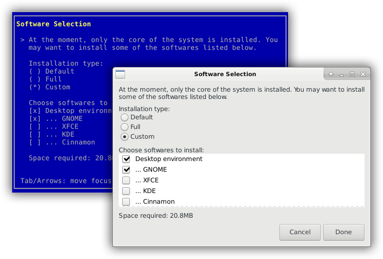

# [](https://github.com/PedroAlvesV/AbsTK)

[](https://gitter.im/AbsTK-Lua/Lobby?utm_source=badge&utm_medium=badge&utm_campaign=pr-badge&utm_content=badge)
[](http://doge.mit-license.org)

The Abstract ToolKit is a widget toolkit for GUI and text-mode applications. It allows you to, with the same source code, build an UI that runs on GUI (GTK) and text-mode (Curses).

[](src/big_image_source.lua)

## Getting Started

### Installation

The easiest way to install AbsTK is through [LuaRocks](https://github.com/luarocks/luarocks):

```
$ luarocks install --server=http://luarocks.org/dev abstk
```

### Concepts

<p align="justify">AbsTK goal is to produce form-like applications that can run with and without a desktop environment (DE). It's worth it for machines that doesn't have any DE installed, but, also, for instance, when the application is an installer, in which you may prefer a light-weight text-mode (curses) interface, instead of using GUI.</p>

<p align="justify">Although the toolkit focus is on building Wizards, individual Screens can also be produced. Actually, building Screens is the main part of building a Wizard. Wizards are nothing more than a group of ordered Screens.</p>

<p align="justify">The routine is really minimalistic, but, as stated in the previous paragraph, has two ways. To create a Screen, you initialize it and populate it with widgets. If your UI is a single Screen, just run it. If it's a Wizard, repeat the previous process to produce all the Screens. When done, simply create the Wizard, populate it with the Screens and run the Wizard.</p>

<p align="justify">About widgets, it's construction functions are quite similar to one another in terms of parameters. Also, there's an important pattern: if the widget is a singular object (like a button), its construction function name will start with "add", like in <code>add_button()</code>. Otherwise, if the widget is, in fact, a group of objets (like a button box), its construction function will start with "create", like in <code>create_button_box()</code>.</p>

You can check API at [https://pedroalvesv.github.io/AbsTK/](https://pedroalvesv.github.io/AbsTK/).

### Examples

#### Screen

```lua
local abstk = require 'abstk'
local scr = abstk.new_screen("My First AbsTK UI")
scr:add_image('logo', 'images/abstk_logo.png')
scr:add_label('hellow', "Hello, World!")
scr:add_label('msg1', "This is a minimal example to demonstrate AbsTK.")
scr:add_label('msg2', "The Screen is the main object of the toolkit. It can run as standalone or added to a Wizard. Its routine consists in creating it (line 2), populating it (lines 3 to 7) and running it (line 8).")
scr:run()
```

(I will add some screenshots here)

[ ](src/example2.lua)

#### Wizard

```lua
local abstk = require 'abstk'
local wizard = abstk.new_wizard("My First AbsTK Wizard")
local scr1 = abstk.new_screen("Page 1")
local scr2 = abstk.new_screen("Page 2")
local scr3 = abstk.new_screen("Page 3")
scr1:add_image('logo', 'images/abstk_logo.png')
scr1:add_label('hellow', "Hello, World!")
scr1:add_label('msg1', "This is a minimal example to demonstrate AbsTK.")
scr2:add_image('logo', 'images/abstk_logo.png')
scr2:add_label('msg2', "The Wizard is what AbsTK was firstly developed. Instead of running Screens, it insert them into an assistant-like interface.Its routine consists on creating it (line 2), creating screens (lines 3 to 5), populating the screens (lines 6 to 12), adding screens to wizard (lines 13 to 15) and running the wizard (line 16).")
scr3:add_image('logo', 'images/abstk_logo.png')
scr3:add_label('thanks_label', "Thank you <3")
wizard:add_page('page1', scr1)
wizard:add_page('page2', scr2)
wizard:add_page('page3', scr3)
wizard:run()
```

(I will add some screenshots here)

[ ](src/example2.lua)

You can see a complete list of examples on [src/complete-test/](src/complete-test/).

### Usage

There are two lines that you will put on the top of most of your codes that use AbsTK:

```lua
local abstk = require 'abstk'
abstk.set_mode(...)
```

<p align="justify">The first one is pretty obvious, it's just the usual lib requirement. The second one is not, actually, necessary, but you'll probably want to use it to, manually, set in which mode the UI will run and see how it looks like. This line gets the args passed when running the application. Like:</p>

```
$ lua minimalist-test.lua curses
```

<p align="justify">All it accepts is "curses" and "gtk", because it's not the kind of thing that should be on the final version of your code. When nothing is passed, the toolkit decides which one to use based on <code>os.getenv("DISPLAY")</code> returning value. If it returns something, the OS runs in a GUI, so AbsTK runs in GUI as well. Otherwise, it runs in text-mode.</p>


## Contributing

1. Create an issue and describe your contribution
2. [Fork it](https://github.com/PedroAlvesV/AbsTK/fork)
3. Create a new branch for your contribution (`git checkout -b my-contribution`)
4. Commit your changes (`git commit -am 'New feature added'`)
5. Publish the branch (`git push origin my-contribution`)
6. Create a Pull Request
7. Done :white_check_mark:

## License

The MIT License (MIT)

Copyright (c) 2017 Pedro Alves Valentim

<p align="justify">Permission is hereby granted, free of charge, to any person obtaining a copy of
this software and associated documentation files (the "Software"), to deal in
the Software without restriction, including without limitation the rights to
use, copy, modify, merge, publish, distribute, sublicense, and/or sell copies of
the Software, and to permit persons to whom the Software is furnished to do so,
subject to the following conditions:</p>

<p align="justify">The above copyright notice and this permission notice shall be included in all
copies or substantial portions of the Software.</p>

<p align="justify">THE SOFTWARE IS PROVIDED "AS IS", WITHOUT WARRANTY OF ANY KIND, EXPRESS OR
IMPLIED, INCLUDING BUT NOT LIMITED TO THE WARRANTIES OF MERCHANTABILITY, FITNESS
FOR A PARTICULAR PURPOSE AND NONINFRINGEMENT. IN NO EVENT SHALL THE AUTHORS OR
COPYRIGHT HOLDERS BE LIABLE FOR ANY CLAIM, DAMAGES OR OTHER LIABILITY, WHETHER
IN AN ACTION OF CONTRACT, TORT OR OTHERWISE, ARISING FROM, OUT OF OR IN
CONNECTION WITH THE SOFTWARE OR THE USE OR OTHER DEALINGS IN THE SOFTWARE.</p>